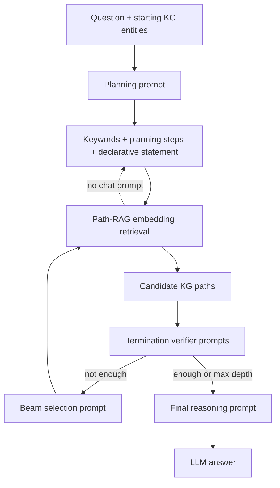

# FiDeLiS Internal Prompt Map

This report visualizes the prompts used by the original FiDeLiS pipeline. It excludes `vanilla_baseline/`.

## Executive Finding

> The final answer prompt is not strictly faithful to the KG. It tells the model to answer based on the reasoning path **and your knowledge**, so the LLM is explicitly allowed to use pretrained parametric knowledge.

| Dataset | Final-answer system prompt issue | Final-answer user prompt issue | Faithfulness risk |
|---|---|---|---|
| RoG-webqsp | Mentions knowledge | `your knowledge` appears | Critical |
| RoG-cwq | Mentions knowledge | `your knowledge` appears | Critical |
| CL-LT-KGQA | Mentions knowledge | `your knowledge` appears | Critical |

## Pipeline Diagram



## Runtime Message Assembly

Every `LLM_Backbone.get_completion(prompt)` call is sent as:

```python
messages = [
    {"role": "system", "content": prompt["system"]},
    *prompt["examples"],
    {"role": "user", "content": prompt["prompt"]},
]
```

Generation parameters in the current code: `temperature=0`, `top_p=0`, `logprobs=False`.

## Prompt Inventory

| Stage | Prompt object | Called from | Purpose | Risk |
|---|---|---|---|---|
| Planning / keyword generation | `plan_prompt` | `LLM_Navigator.planning()` | Generates keywords, planning steps, and declarative statement used by Path-RAG and verification. | Medium |
| Beam candidate selection | `beam_search_prompt` | `LLM_Navigator.decide_top_k_candidates()` | Selects candidate reasoning paths by index from Path-RAG candidates. | Medium |
| Path verbalization | `reasoning_path_parser_prompt` | `LLM_Navigator.rpth_parser()` | Turns a symbolic KG path into a natural-language statement before deductive verification. | Medium |
| Enough-evidence verifier | `terminals_prune_single_prompt` | `LLM_Navigator.deductive_termination()` when `--verifier enough` | Asks whether a path is sufficient to answer the question. | High |
| Deductive verifier | `deductive_verifier_prompt` | `LLM_Navigator.deductive_termination()` when `--verifier deductive+planning` | Checks whether the declarative answer can be deduced from the parsed path. | High |
| Final answer generation | `reasoning_prompt` | `LLM_Navigator.reasoning()` | Produces the final answer from selected reasoning paths. | Critical |

## Faithfulness Risk Points

| Risk point | Why it matters | Evidence in prompt/code |
|---|---|---|
| Final answer can use pretrained knowledge | The answer may be correct even if the KG path is weak, irrelevant, or incomplete. | `reasoning_prompt` says `based on the reasoning path and your knowledge`. |
| CR-LT True/False can be guessed | Binary labels make random guessing about 50%, and the prompt does not require KG-only entailment. | CR-LT asks for True/False but still allows `your knowledge` in the final user template. |
| Path sufficiency verifier is also LLM-based | The verifier can judge sufficiency using prior knowledge instead of only path evidence. | `terminals_prune_single_prompt` asks whether a path is sufficient, but does not forbid outside knowledge. |
| Deductive verifier depends on path verbalization | If path parser adds unstated information, verifier may validate a stronger statement than the KG path supports. | `reasoning_path_parser_prompt` asks the model to transfer symbolic path to statement. |

## Full Prompt Cards

### RoG-webqsp

Source: `src/prompts/webqsp.py`

| Prompt | System summary | Example messages | User template summary | Risk |
|---|---|---:|---|---|
| `plan_prompt` | You are a helpful assistant designed to output JSON that aids in navigating a knowledge graph to answer a provided ques... | 0 | {question}? | Medium |
| `beam_search_prompt` | Given a question and the starting entity from a knowledge graph, you are asked to retrieve reasoning paths from the giv... | 2 | Considering the planning context {plan_context} and the given question {question}, you are asked to choose the best {be... | Medium |
| `reasoning_path_parser_prompt` | You are asked to transfer the reasoning path to a statment, for example, convet the reasoning path &#x27;Henri Matisse-&gt;book... | 0 | {reasoning_path} | Medium |
| `terminals_prune_single_prompt` | Given a question and the starting entity from a knowledge graph, you are asked to answer whether it&#x27;s sufficient for yo... | 6 | Considering the planning context {plan_context} and the given question {question}, you are asked to answer whether it&#x27;s... | High |
| `deductive_verifier_prompt` | You are asked to verify whether the reasoning step follows deductively from the question and the current reasoning path... | 0 | Whether the conclusion &#x27;{declarative_statement}&#x27; can be deduced from &#x27;{parsed_reasoning_path}&#x27;, if yes, return yes, if ... | High |
| `reasoning_prompt` | Given a question and the associated retrieved reasoning path from a knowledge graph, you are asked to answer the follow... | 10 | Given a question and the associated retrieved reasoning path from a knowledge graph, you are asked to answer the follow... | Critical |

<details>
<summary><strong>plan_prompt</strong>: Planning / keyword generation (Medium risk)</summary>

**System**

```text
You are a helpful assistant designed to output JSON that aids in navigating a knowledge graph to answer a provided question. The response should include the following keys: (1) 'keywords': an exhaustive list of keywords or relation names that you would use to find the reasoning path from the knowledge graph to answer the question. Aim for maximum coverage to ensure no potential reasoning paths will be overlooked; (2) 'planning_steps': a list of detailed steps required to trace the reasoning path with. Each step should be a string instead of a dict. (3) 'declarative_statement': a string of declarative statement that can be transformed from the given query, For example, convert the question 'What do Jamaican people speak?' into the statement 'Jamaican people speak *placeholder*.' leave the *placeholder* unchanged; Ensure the JSON object clearly separates these components.
```

**Examples: 0 messages**

_No examples._

**User prompt template**

```text
{question}?
```

</details>

<details>
<summary><strong>beam_search_prompt</strong>: Beam candidate selection (Medium risk)</summary>

**System**

```text
Given a question and the starting entity from a knowledge graph, you are asked to retrieve reasoning paths from the given reasoning paths that are useful for answering the question.
```

**Examples: 2 messages**

Example message 1, role=`user`
```text
Question: what art movements was henri matisse involved in?
 To proceed, the starting entity is Henri Matisse
 Out of the following candidates for the next step, choose the best 5 with the highest probability to lead to a useful reasoning path for answering the question. 
Candidates: 1: book.written_work.subjects
2: exhibitions.exhibition_subject.exhibitions_created_about_this_subject
3: influence.influence_node.peers
4: visual_art.artwork.artist
5: book.author.works_written
6: influence.influence_node.influenced
7: visual_art.art_series.artist
8: book.book_subject.works
9: influence.influence_node.influenced_by
10: people.person.profession
11: common.topic.article
12: influence.influence_node.influenced
13: common.topic.notable_for
14: education.education.student
15: influence.influence_node.influenced_by
16: influence.influence_node.influenced
17: influence.influence_node.influenced_by
18: common.topic.notable_types
19: influence.influence_node.influenced
20: influence.influence_node.influenced_by
21: base.patronage.patron_client_relationship.client
22: influence.influence_node.influenced
23: visual_art.artwork.artist
24: education.education.student
25: book.written_work.author
26: visual_art.artwork.artist
27: exhibitions.exhibition.subjects
28: visual_art.artwork.artist
29: book.written_work.author
30: visual_art.visual_artist.art_forms
31: book.book_subject.works
32: visual_art.artwork.artist
33: people.person.nationality
34: visual_art.visual_art_form.artists
35: influence.influence_node.influenced_by
36: visual_art.artwork.artist
37: people.person.parents
38: visual_art.artwork.artist
39: influence.influence_node.influenced_by
40: visual_art.art_period_movement.associated_artists
41: influence.influence_node.influenced_by
42: people.person.parents
43: base.patronage.patron_client_relationship.client
44: exhibitions.exhibition_subject.exhibitions_created_about_this_subject
45: exhibitions.exhibition.subjects
46: visual_art.visual_artist.art_series
47: visual_art.artwork.artist
48: visual_art.visual_artist.associated_periods_or_movements
49: influence.peer_relationship.peers
50: exhibitions.exhibition.subjects
51: visual_art.artwork.artist
52: influence.influence_node.influenced
53: influence.influence_node.influenced_by
54: influence.influence_node.influenced
55: influence.influence_node.influenced_by
56: influence.influence_node.influenced_by
57: visual_art.artwork.artist
58: exhibitions.exhibition_subject.exhibitions_created_about_this_subject
59: book.written_work.subjects
60: influence.influence_node.influenced
61: people.person.parents
62: influence.influence_node.influenced_by
63: influence.influence_node.peers
64: exhibitions.exhibition.subjects
65: base.patronage.patron_client_relationship.client
66: film.personal_film_appearance.person
67: influence.influence_node.influenced_by
68: common.webpage.topic
69: exhibitions.exhibition.subjects
70: influence.influence_node.influenced_by
71: common.image.appears_in_topic_gallery
72: people.person.place_of_birth
73: book.written_work.author
74: film.film_character.portrayed_in_films
75: influence.influence_node.influenced
76: influence.influence_node.peers
77: people.person.parents
78: base.patronage.client.related_patron
79: influence.influence_node.influenced
80: influence.influence_node.influenced_by
81: influence.influence_node.influenced_by
82: book.written_work.subjects
83: influence.influence_node.peers
84: influence.influence_node.influenced
85: symbols.namesake.named_after
86: influence.influence_node.influenced_by
87: visual_art.artwork.artist
88: common.image.size
89: freebase.valuenotation.is_reviewed
90: visual_art.artwork.artist
91: book.author.works_written
92: symbols.name_source.namesakes
93: visual_art.visual_artist.associated_periods_or_movements
94: visual_art.artwork.artist
95: people.person.spouse_s
96: influence.influence_node.influenced_by
97: freebase.valuenotation.is_reviewed
98: visual_art.visual_artist.art_series
99: people.deceased_person.cause_of_death
100: freebase.valuenotation.is_reviewed
101: influence.influence_node.influenced
102: influence.influence_node.influenced_by
103: book.written_work.author
104: influence.influence_node.influenced
105: influence.influence_node.influenced
106: people.person.parents
107: visual_art.artwork.artist
108: visual_art.artwork.artist
109: visual_art.artwork.artist
110: visual_art.artwork.artist
111: exhibitions.exhibition.subjects
112: visual_art.artwork.artist
113: freebase.valuenotation.is_reviewed
114: people.deceased_person.place_of_death
115: people.person.profession
116: people.place_lived.person
117: common.topic.notable_for
118: exhibitions.exhibition_subject.exhibitions_created_about_this_subject
119: freebase.valuenotation.is_reviewed
120: influence.influence_node.influenced_by
121: visual_art.visual_artist.associated_periods_or_movements
122: visual_art.artwork.artist
123: visual_art.artwork.artist
124: people.person.gender
125: influence.influence_node.influenced
126: influence.influence_node.influenced_by
127: visual_art.artwork.artist
128: visual_art.artwork.artist
129: visual_art.artwork.artist
130: influence.influence_node.influenced
131: visual_art.artwork.artist
132: visual_art.artwork.artist
133: freebase.valuenotation.is_reviewed
134: visual_art.artwork.artist
135: symbols.namesake.named_after
136: visual_art.visual_artist.art_forms
137: freebase.valuenotation.is_reviewed
138: people.person.ethnicity
139: freebase.valuenotation.is_reviewed
140: freebase.valuenotation.is_reviewed
141: visual_art.visual_artist.associated_periods_or_movements
142: visual_art.visual_artist.art_forms
143: freebase.valuenotation.has_value
144: exhibitions.exhibition.subjects
145: visual_art.artwork.artist
146: visual_art.visual_artist.art_forms
147: visual_art.artwork.artist
148: visual_art.artwork.artist
149: visual_art.artwork.artist Only return the index of the 3 selected reasoning path in a list.
```
Example message 2, role=`assistant`
```text
Answer: [40, 48, 93, 121, 141]
```
**User prompt template**

```text
Considering the planning context {plan_context} and the given question {question}, 
you are asked to choose the best {beam_width} reasoning paths from the following candidates with the highest probability to lead to a useful reasoning path for answering the question. {reasoning_paths}. 

Only return the index of the {beam_width} selected reasoning paths in a list.
```

</details>

<details>
<summary><strong>reasoning_path_parser_prompt</strong>: Path verbalization (Medium risk)</summary>

**System**

```text
You are asked to transfer the reasoning path to a statment, for example, convet the reasoning path 'Henri Matisse->book.written_work.subjects->Matisse, Picasso' to 'Henri Matisse wrote a book about Matisse and Picasso'.
```

**Examples: 0 messages**

_No examples._

**User prompt template**

```text
{reasoning_path}
```

</details>

<details>
<summary><strong>terminals_prune_single_prompt</strong>: Enough-evidence verifier (High risk)</summary>

**System**

```text
Given a question and the starting entity from a knowledge graph, you are asked to answer whether it's sufficient for you to answer the question with the following reasoning path. For each reasoning path, respond with 'Yes' if it is sufficient, and 'No' if it is not. Your response should be either 'Yes' or 'No', corresponding to reasoning path.
```

**Examples: 6 messages**

Example message 1, role=`user`
```text
Question: what art movements was henri matisse involved in?
 Reasoning path: 
Henri Matisse->book.written_work.subjects->Matisse, Picasso
```
Example message 2, role=`assistant`
```text
Answer: No
```
Example message 3, role=`user`
```text
Question: what team did tim tebow play for in college?
Reasoning path: 
Tim Tebow->people.sibling_relationship.sibling->m.05v4ns_
```
Example message 4, role=`assistant`
```text
Answer: No
```
Example message 5, role=`user`
```text
Question: where does selena gomez live right now 2010?
Reasoning Path: 
Selena Gomez->people.person.places_lived->m.04hmnxs->people.place_lived.location->New York City
```
Example message 6, role=`assistant`
```text
Answer: Yes
```
**User prompt template**

```text
Considering the planning context {plan_context} and the given question {question}, you are asked to answer whether it's sufficient for you to answer the question with the following reasoning path. {reasoning_path}. Verify if it is sufficient to answer the question with each of the provided reasoning path. Your response should either 'Yes' or 'No', corresponding to reasoning path. 
Answer:
```

</details>

<details>
<summary><strong>deductive_verifier_prompt</strong>: Deductive verifier (High risk)</summary>

**System**

```text
You are asked to verify whether the reasoning step follows deductively from the question and the current reasoning path in a deductive manner. If yes return yes, if no, return no
```

**Examples: 0 messages**

_No examples._

**User prompt template**

```text
Whether the conclusion '{declarative_statement}' can be deduced from '{parsed_reasoning_path}', if yes, return yes, if no, return no.
```

</details>

<details>
<summary><strong>reasoning_prompt</strong>: Final answer generation (Critical risk)</summary>

**System**

```text
Given a question and the associated retrieved reasoning path from a knowledge graph, you are asked to answer the following question based on the reasoning path and your knowledge. Only return the answer to the question.
```

**Examples: 10 messages**

Example message 1, role=`user`
```text
Question: what art movements was henri matisse involved in? 
Reasoning path: Henri Matisse->visual_art.visual_artist.associated_periods_or_movements->Neo-impressionism
```
Example message 2, role=`assistant`
```text
Answer: Neo-impressionism
```
Example message 3, role=`user`
```text
Question: what team did tim tebow play for in college
 Reasoning path: Tim Tebow->sports.sports_team_roster.player->m.0hpc6gc->sports.sports_team_roster.team->Florida Gators football
```
Example message 4, role=`assistant`
```text
Answer: Florida Gators football
```
Example message 5, role=`user`
```text
Question: who won 2012 presidential election in france?
Reasoning path: French presidential election, 2012->government.election.winner->François Hollande
```
Example message 6, role=`assistant`
```text
Answer: François Hollande
```
Example message 7, role=`user`
```text
Question: what is the name of the person who wrote the book that was made into the movie that won the Academy Award for Best Picture in 2014?
Reasoning path: Academy Award for Best Picture, 2014->film.film.film_award_wins->12 Years a Slave->film.film.written_by->John Ridley
```
Example message 8, role=`assistant`
```text
Answer: John Ridley
```
Example message 9, role=`user`
```text
Question: where does selena gomez live right now 2010?
Reasoning Path: Selena Gomez->people.person.places_lived->m.04hmnxs->people.place_lived.location->New York City
```
Example message 10, role=`assistant`
```text
Answer: New York City
```
**User prompt template**

```text
Given a question and the associated retrieved reasoning path from a knowledge graph, you are asked to answer the following question based on the reasoning path and your knowledge. 
Question: {question} 
Reasoning path: {reasoning_path} 
Only return the answer to the question.
```

</details>

### RoG-cwq

Source: `src/prompts/cwq.py`

| Prompt | System summary | Example messages | User template summary | Risk |
|---|---|---:|---|---|
| `plan_prompt` | You are a helpful assistant designed to output JSON that aids in navigating a knowledge graph to answer a provided ques... | 0 | {question}? | Medium |
| `beam_search_prompt` | Given a question and the starting entity from a knowledge graph, you are asked to retrieve reasoning paths from the giv... | 2 | Considering the planning context {plan_context} and the given question {question}, you are asked to choose the best {be... | Medium |
| `reasoning_path_parser_prompt` | You are asked to transfer the reasoning path to a statment, for example, convet the reasoning path &#x27;Henri Matisse-&gt;book... | 0 | {reasoning_path} | Medium |
| `terminals_prune_single_prompt` | Given a question and the starting entity from a knowledge graph, you are asked to answer whether it&#x27;s sufficient for yo... | 0 | Considering the planning context {plan_context} and the given question {question}, you are asked to answer whether it&#x27;s... | High |
| `deductive_verifier_prompt` | You are asked to verify whether the reasoning step follows deductively from the question and the current reasoning path... | 0 | Whether the conclusion &#x27;{declarative_statement}&#x27; can be deduced from &#x27;{parsed_reasoning_path}&#x27;, if yes, return yes, if ... | High |
| `reasoning_prompt` | Given a question and the associated retrieved reasoning path from a knowledge graph, you are asked to answer the follow... | 10 | Given a question and the associated retrieved reasoning path from a knowledge graph, you are asked to answer the follow... | Critical |

<details>
<summary><strong>plan_prompt</strong>: Planning / keyword generation (Medium risk)</summary>

**System**

```text
You are a helpful assistant designed to output JSON that aids in navigating a knowledge graph to answer a provided question. The response should include the following keys: (1) 'keywords': an exhaustive list of keywords or relation names that you would use to find the reasoning path from the knowledge graph to answer the question. Aim for maximum coverage to ensure no potential reasoning paths will be overlooked; (2) 'planning_steps': a list of detailed steps required to trace the reasoning path with. Each step should be a string instead of a dict. (3) 'declarative_statement': a string of declarative statement that can be transformed from the given query, For example, convert the question 'What do Jamaican people speak?' into the statement 'Jamaican people speak *placeholder*.' leave the *placeholder* unchanged; Ensure the JSON object clearly separates these components.
```

**Examples: 0 messages**

_No examples._

**User prompt template**

```text
{question}?
```

</details>

<details>
<summary><strong>beam_search_prompt</strong>: Beam candidate selection (Medium risk)</summary>

**System**

```text
Given a question and the starting entity from a knowledge graph, you are asked to retrieve reasoning paths from the given reasoning paths that are useful for answering the question.
```

**Examples: 2 messages**

Example message 1, role=`user`
```text
Question: what art movements was henri matisse involved in?
 To proceed, the starting entity is Henri Matisse
 Out of the following candidates for the next step, choose the best 5 with the highest probability to lead to a useful reasoning path for answering the question. 
Candidates: 1: book.written_work.subjects
2: exhibitions.exhibition_subject.exhibitions_created_about_this_subject
3: influence.influence_node.peers
4: visual_art.artwork.artist
5: book.author.works_written
6: influence.influence_node.influenced
7: visual_art.art_series.artist
8: book.book_subject.works
9: influence.influence_node.influenced_by
10: people.person.profession
11: common.topic.article
12: influence.influence_node.influenced
13: common.topic.notable_for
14: education.education.student
15: influence.influence_node.influenced_by
16: influence.influence_node.influenced
17: influence.influence_node.influenced_by
18: common.topic.notable_types
19: influence.influence_node.influenced
20: influence.influence_node.influenced_by
21: base.patronage.patron_client_relationship.client
22: influence.influence_node.influenced
23: visual_art.artwork.artist
24: education.education.student
25: book.written_work.author
26: visual_art.artwork.artist
27: exhibitions.exhibition.subjects
28: visual_art.artwork.artist
29: book.written_work.author
30: visual_art.visual_artist.art_forms
31: book.book_subject.works
32: visual_art.artwork.artist
33: people.person.nationality
34: visual_art.visual_art_form.artists
35: influence.influence_node.influenced_by
36: visual_art.artwork.artist
37: people.person.parents
38: visual_art.artwork.artist
39: influence.influence_node.influenced_by
40: visual_art.art_period_movement.associated_artists
41: influence.influence_node.influenced_by
42: people.person.parents
43: base.patronage.patron_client_relationship.client
44: exhibitions.exhibition_subject.exhibitions_created_about_this_subject
45: exhibitions.exhibition.subjects
46: visual_art.visual_artist.art_series
47: visual_art.artwork.artist
48: visual_art.visual_artist.associated_periods_or_movements
49: influence.peer_relationship.peers
50: exhibitions.exhibition.subjects
51: visual_art.artwork.artist
52: influence.influence_node.influenced
53: influence.influence_node.influenced_by
54: influence.influence_node.influenced
55: influence.influence_node.influenced_by
56: influence.influence_node.influenced_by
57: visual_art.artwork.artist
58: exhibitions.exhibition_subject.exhibitions_created_about_this_subject
59: book.written_work.subjects
60: influence.influence_node.influenced
61: people.person.parents
62: influence.influence_node.influenced_by
63: influence.influence_node.peers
64: exhibitions.exhibition.subjects
65: base.patronage.patron_client_relationship.client
66: film.personal_film_appearance.person
67: influence.influence_node.influenced_by
68: common.webpage.topic
69: exhibitions.exhibition.subjects
70: influence.influence_node.influenced_by
71: common.image.appears_in_topic_gallery
72: people.person.place_of_birth
73: book.written_work.author
74: film.film_character.portrayed_in_films
75: influence.influence_node.influenced
76: influence.influence_node.peers
77: people.person.parents
78: base.patronage.client.related_patron
79: influence.influence_node.influenced
80: influence.influence_node.influenced_by
81: influence.influence_node.influenced_by
82: book.written_work.subjects
83: influence.influence_node.peers
84: influence.influence_node.influenced
85: symbols.namesake.named_after
86: influence.influence_node.influenced_by
87: visual_art.artwork.artist
88: common.image.size
89: freebase.valuenotation.is_reviewed
90: visual_art.artwork.artist
91: book.author.works_written
92: symbols.name_source.namesakes
93: visual_art.visual_artist.associated_periods_or_movements
94: visual_art.artwork.artist
95: people.person.spouse_s
96: influence.influence_node.influenced_by
97: freebase.valuenotation.is_reviewed
98: visual_art.visual_artist.art_series
99: people.deceased_person.cause_of_death
100: freebase.valuenotation.is_reviewed
101: influence.influence_node.influenced
102: influence.influence_node.influenced_by
103: book.written_work.author
104: influence.influence_node.influenced
105: influence.influence_node.influenced
106: people.person.parents
107: visual_art.artwork.artist
108: visual_art.artwork.artist
109: visual_art.artwork.artist
110: visual_art.artwork.artist
111: exhibitions.exhibition.subjects
112: visual_art.artwork.artist
113: freebase.valuenotation.is_reviewed
114: people.deceased_person.place_of_death
115: people.person.profession
116: people.place_lived.person
117: common.topic.notable_for
118: exhibitions.exhibition_subject.exhibitions_created_about_this_subject
119: freebase.valuenotation.is_reviewed
120: influence.influence_node.influenced_by
121: visual_art.visual_artist.associated_periods_or_movements
122: visual_art.artwork.artist
123: visual_art.artwork.artist
124: people.person.gender
125: influence.influence_node.influenced
126: influence.influence_node.influenced_by
127: visual_art.artwork.artist
128: visual_art.artwork.artist
129: visual_art.artwork.artist
130: influence.influence_node.influenced
131: visual_art.artwork.artist
132: visual_art.artwork.artist
133: freebase.valuenotation.is_reviewed
134: visual_art.artwork.artist
135: symbols.namesake.named_after
136: visual_art.visual_artist.art_forms
137: freebase.valuenotation.is_reviewed
138: people.person.ethnicity
139: freebase.valuenotation.is_reviewed
140: freebase.valuenotation.is_reviewed
141: visual_art.visual_artist.associated_periods_or_movements
142: visual_art.visual_artist.art_forms
143: freebase.valuenotation.has_value
144: exhibitions.exhibition.subjects
145: visual_art.artwork.artist
146: visual_art.visual_artist.art_forms
147: visual_art.artwork.artist
148: visual_art.artwork.artist
149: visual_art.artwork.artist Only return the index of the 3 selected reasoning path in a list.
```
Example message 2, role=`assistant`
```text
Answer: [40, 48, 93, 121, 141]
```
**User prompt template**

```text
Considering the planning context {plan_context} and the given question {question}, 
you are asked to choose the best {beam_width} reasoning paths from the following candidates with the highest probability to lead to a useful reasoning path for answering the question. {reasoning_paths}. 

Only return the index of the {beam_width} selected reasoning paths in a list.
```

</details>

<details>
<summary><strong>reasoning_path_parser_prompt</strong>: Path verbalization (Medium risk)</summary>

**System**

```text
You are asked to transfer the reasoning path to a statment, for example, convet the reasoning path 'Henri Matisse->book.written_work.subjects->Matisse, Picasso' to 'Henri Matisse wrote a book about Matisse and Picasso'.
```

**Examples: 0 messages**

_No examples._

**User prompt template**

```text
{reasoning_path}
```

</details>

<details>
<summary><strong>terminals_prune_single_prompt</strong>: Enough-evidence verifier (High risk)</summary>

**System**

```text
Given a question and the starting entity from a knowledge graph, you are asked to answer whether it's sufficient for you to answer the question with the following reasoning path. For each reasoning path, respond with 'Yes' if it is sufficient, and 'No' if it is not. Your response should be either 'Yes' or 'No', corresponding to reasoning path.
```

**Examples: 0 messages**

_No examples._

**User prompt template**

```text
Considering the planning context {plan_context} and the given question {question}, you are asked to answer whether it's sufficient for you to answer the question with the following reasoning path. {reasoning_path}. Verify if it is sufficient to answer the question with each of the provided reasoning path. Your response should either 'Yes' or 'No', corresponding to reasoning path. 
Answer:
```

</details>

<details>
<summary><strong>deductive_verifier_prompt</strong>: Deductive verifier (High risk)</summary>

**System**

```text
You are asked to verify whether the reasoning step follows deductively from the question and the current reasoning path in a deductive manner. If yes return yes, if no, return no
```

**Examples: 0 messages**

_No examples._

**User prompt template**

```text
Whether the conclusion '{declarative_statement}' can be deduced from '{parsed_reasoning_path}', if yes, return yes, if no, return no.
```

</details>

<details>
<summary><strong>reasoning_prompt</strong>: Final answer generation (Critical risk)</summary>

**System**

```text
Given a question and the associated retrieved reasoning path from a knowledge graph, you are asked to answer the following question based on the reasoning path and your knowledge. Only return the answer to the question.
```

**Examples: 10 messages**

Example message 1, role=`user`
```text
Question: what art movements was henri matisse involved in? 
Reasoning path: Henri Matisse->visual_art.visual_artist.associated_periods_or_movements->Neo-impressionism
```
Example message 2, role=`assistant`
```text
Answer: Neo-impressionism
```
Example message 3, role=`user`
```text
Question: what team did tim tebow play for in college
 Reasoning path: Tim Tebow->sports.sports_team_roster.player->m.0hpc6gc->sports.sports_team_roster.team->Florida Gators football
```
Example message 4, role=`assistant`
```text
Answer: Florida Gators football
```
Example message 5, role=`user`
```text
Question: who won 2012 presidential election in france?
Reasoning path: French presidential election, 2012->government.election.winner->François Hollande
```
Example message 6, role=`assistant`
```text
Answer: François Hollande
```
Example message 7, role=`user`
```text
Question: what is the name of the person who wrote the book that was made into the movie that won the Academy Award for Best Picture in 2014?
Reasoning path: Academy Award for Best Picture, 2014->film.film.film_award_wins->12 Years a Slave->film.film.written_by->John Ridley
```
Example message 8, role=`assistant`
```text
Answer: John Ridley
```
Example message 9, role=`user`
```text
Question: where does selena gomez live right now 2010?
Reasoning Path: Selena Gomez->people.person.places_lived->m.04hmnxs->people.place_lived.location->New York City
```
Example message 10, role=`assistant`
```text
Answer: New York City
```
**User prompt template**

```text
Given a question and the associated retrieved reasoning path from a knowledge graph, you are asked to answer the following question based on the reasoning path and your knowledge. 
Question: {question} 
Reasoning path: {reasoning_path} 
Only return the answer to the question.
```

</details>

### CL-LT-KGQA

Source: `src/prompts/cl_lt_kgqa.py`

| Prompt | System summary | Example messages | User template summary | Risk |
|---|---|---:|---|---|
| `plan_prompt` | You are a helpful assistant designed to output JSON that aids in navigating a knowledge graph to answer a provided ques... | 0 | {question}? | Medium |
| `beam_search_prompt` | Given a question and the starting entity from a knowledge graph, you are asked to retrieve reasoning paths from the giv... | 2 | Considering the planning context {plan_context} and the given question {question}, you are asked to choose the best {be... | Medium |
| `reasoning_path_parser_prompt` | You are asked to transfer the reasoning path to a statment, for example, convet the reasoning path &#x27;Henri Matisse-&gt;book... | 0 | {reasoning_path} | Medium |
| `terminals_prune_single_prompt` | Given a question and the starting entity from a knowledge graph, you are asked to answer whether it&#x27;s sufficient for yo... | 0 | Considering the planning context {plan_context} and the given question {question}, you are asked to answer whether it&#x27;s... | High |
| `deductive_verifier_prompt` | You are asked to verify whether the reasoning step follows deductively from the question and the current reasoning path... | 0 | Whether the conclusion &#x27;{declarative_statement}&#x27; can be deduced from &#x27;{parsed_reasoning_path}&#x27;, if yes, return yes, if ... | High |
| `reasoning_prompt` | Given a question and the associated retrieved reasoning path from a knowledge graph, you are asked to verifiy the corre... | 10 | Given a question and the associated retrieved reasoning path from a knowledge graph, you are asked to answer the follow... | Critical |

<details>
<summary><strong>plan_prompt</strong>: Planning / keyword generation (Medium risk)</summary>

**System**

```text
You are a helpful assistant designed to output JSON that aids in navigating a knowledge graph to answer a provided question. The response should include the following keys: (1) 'keywords': an exhaustive list of keywords or relation names that you would use to find the reasoning path from the knowledge graph to answer the question. Aim for maximum coverage to ensure no potential reasoning paths will be overlooked; (2) 'planning_steps': a list of detailed steps required to trace the reasoning path with. Each step should be a string instead of a dict. (3) 'declarative_statement': a string of declarative statement that can be transformed from the given query, For example, convert the question 'What do Jamaican people speak?' into the statement 'Jamaican people speak *placeholder*.' leave the *placeholder* unchanged; Ensure the JSON object clearly separates these components.
```

**Examples: 0 messages**

_No examples._

**User prompt template**

```text
{question}?
```

</details>

<details>
<summary><strong>beam_search_prompt</strong>: Beam candidate selection (Medium risk)</summary>

**System**

```text
Given a question and the starting entity from a knowledge graph, you are asked to retrieve reasoning paths from the given reasoning paths that are useful for answering the question.
```

**Examples: 2 messages**

Example message 1, role=`user`
```text
Question: what art movements was henri matisse involved in?
 To proceed, the starting entity is Henri Matisse
 Out of the following candidates for the next step, choose the best 5 with the highest probability to lead to a useful reasoning path for answering the question. 
Candidates: 1: book.written_work.subjects
2: exhibitions.exhibition_subject.exhibitions_created_about_this_subject
3: influence.influence_node.peers
4: visual_art.artwork.artist
5: book.author.works_written
6: influence.influence_node.influenced
7: visual_art.art_series.artist
8: book.book_subject.works
9: influence.influence_node.influenced_by
10: people.person.profession
11: common.topic.article
12: influence.influence_node.influenced
13: common.topic.notable_for
14: education.education.student
15: influence.influence_node.influenced_by
16: influence.influence_node.influenced
17: influence.influence_node.influenced_by
18: common.topic.notable_types
19: influence.influence_node.influenced
20: influence.influence_node.influenced_by
21: base.patronage.patron_client_relationship.client
22: influence.influence_node.influenced
23: visual_art.artwork.artist
24: education.education.student
25: book.written_work.author
26: visual_art.artwork.artist
27: exhibitions.exhibition.subjects
28: visual_art.artwork.artist
29: book.written_work.author
30: visual_art.visual_artist.art_forms
31: book.book_subject.works
32: visual_art.artwork.artist
33: people.person.nationality
34: visual_art.visual_art_form.artists
35: influence.influence_node.influenced_by
36: visual_art.artwork.artist
37: people.person.parents
38: visual_art.artwork.artist
39: influence.influence_node.influenced_by
40: visual_art.art_period_movement.associated_artists
41: influence.influence_node.influenced_by
42: people.person.parents
43: base.patronage.patron_client_relationship.client
44: exhibitions.exhibition_subject.exhibitions_created_about_this_subject
45: exhibitions.exhibition.subjects
46: visual_art.visual_artist.art_series
47: visual_art.artwork.artist
48: visual_art.visual_artist.associated_periods_or_movements
49: influence.peer_relationship.peers
50: exhibitions.exhibition.subjects
51: visual_art.artwork.artist
52: influence.influence_node.influenced
53: influence.influence_node.influenced_by
54: influence.influence_node.influenced
55: influence.influence_node.influenced_by
56: influence.influence_node.influenced_by
57: visual_art.artwork.artist
58: exhibitions.exhibition_subject.exhibitions_created_about_this_subject
59: book.written_work.subjects
60: influence.influence_node.influenced
61: people.person.parents
62: influence.influence_node.influenced_by
63: influence.influence_node.peers
64: exhibitions.exhibition.subjects
65: base.patronage.patron_client_relationship.client
66: film.personal_film_appearance.person
67: influence.influence_node.influenced_by
68: common.webpage.topic
69: exhibitions.exhibition.subjects
70: influence.influence_node.influenced_by
71: common.image.appears_in_topic_gallery
72: people.person.place_of_birth
73: book.written_work.author
74: film.film_character.portrayed_in_films
75: influence.influence_node.influenced
76: influence.influence_node.peers
77: people.person.parents
78: base.patronage.client.related_patron
79: influence.influence_node.influenced
80: influence.influence_node.influenced_by
81: influence.influence_node.influenced_by
82: book.written_work.subjects
83: influence.influence_node.peers
84: influence.influence_node.influenced
85: symbols.namesake.named_after
86: influence.influence_node.influenced_by
87: visual_art.artwork.artist
88: common.image.size
89: freebase.valuenotation.is_reviewed
90: visual_art.artwork.artist
91: book.author.works_written
92: symbols.name_source.namesakes
93: visual_art.visual_artist.associated_periods_or_movements
94: visual_art.artwork.artist
95: people.person.spouse_s
96: influence.influence_node.influenced_by
97: freebase.valuenotation.is_reviewed
98: visual_art.visual_artist.art_series
99: people.deceased_person.cause_of_death
100: freebase.valuenotation.is_reviewed
101: influence.influence_node.influenced
102: influence.influence_node.influenced_by
103: book.written_work.author
104: influence.influence_node.influenced
105: influence.influence_node.influenced
106: people.person.parents
107: visual_art.artwork.artist
108: visual_art.artwork.artist
109: visual_art.artwork.artist
110: visual_art.artwork.artist
111: exhibitions.exhibition.subjects
112: visual_art.artwork.artist
113: freebase.valuenotation.is_reviewed
114: people.deceased_person.place_of_death
115: people.person.profession
116: people.place_lived.person
117: common.topic.notable_for
118: exhibitions.exhibition_subject.exhibitions_created_about_this_subject
119: freebase.valuenotation.is_reviewed
120: influence.influence_node.influenced_by
121: visual_art.visual_artist.associated_periods_or_movements
122: visual_art.artwork.artist
123: visual_art.artwork.artist
124: people.person.gender
125: influence.influence_node.influenced
126: influence.influence_node.influenced_by
127: visual_art.artwork.artist
128: visual_art.artwork.artist
129: visual_art.artwork.artist
130: influence.influence_node.influenced
131: visual_art.artwork.artist
132: visual_art.artwork.artist
133: freebase.valuenotation.is_reviewed
134: visual_art.artwork.artist
135: symbols.namesake.named_after
136: visual_art.visual_artist.art_forms
137: freebase.valuenotation.is_reviewed
138: people.person.ethnicity
139: freebase.valuenotation.is_reviewed
140: freebase.valuenotation.is_reviewed
141: visual_art.visual_artist.associated_periods_or_movements
142: visual_art.visual_artist.art_forms
143: freebase.valuenotation.has_value
144: exhibitions.exhibition.subjects
145: visual_art.artwork.artist
146: visual_art.visual_artist.art_forms
147: visual_art.artwork.artist
148: visual_art.artwork.artist
149: visual_art.artwork.artist Only return the index of the 3 selected reasoning path in a list.
```
Example message 2, role=`assistant`
```text
Answer: [40, 48, 93, 121, 141]
```
**User prompt template**

```text
Considering the planning context {plan_context} and the given question {question}, 
you are asked to choose the best {beam_width} reasoning paths from the following candidates with the highest probability to lead to a useful reasoning path for answering the question. {reasoning_paths}. 

Only return the index of the {beam_width} selected reasoning paths in a list.
```

</details>

<details>
<summary><strong>reasoning_path_parser_prompt</strong>: Path verbalization (Medium risk)</summary>

**System**

```text
You are asked to transfer the reasoning path to a statment, for example, convet the reasoning path 'Henri Matisse->book.written_work.subjects->Matisse, Picasso' to 'Henri Matisse wrote a book about Matisse and Picasso'.
```

**Examples: 0 messages**

_No examples._

**User prompt template**

```text
{reasoning_path}
```

</details>

<details>
<summary><strong>terminals_prune_single_prompt</strong>: Enough-evidence verifier (High risk)</summary>

**System**

```text
Given a question and the starting entity from a knowledge graph, you are asked to answer whether it's sufficient for you to answer the question with the following reasoning path. For each reasoning path, respond with 'Yes' if it is sufficient, and 'No' if it is not. Your response should be either 'Yes' or 'No', corresponding to reasoning path.
```

**Examples: 0 messages**

_No examples._

**User prompt template**

```text
Considering the planning context {plan_context} and the given question {question}, you are asked to answer whether it's sufficient for you to answer the question with the following reasoning path. {reasoning_path}. Verify if it is sufficient to answer the question with each of the provided reasoning path. Your response should either 'Yes' or 'No', corresponding to reasoning path. 
Answer:
```

</details>

<details>
<summary><strong>deductive_verifier_prompt</strong>: Deductive verifier (High risk)</summary>

**System**

```text
You are asked to verify whether the reasoning step follows deductively from the question and the current reasoning path in a deductive manner. If yes return yes, if no, return no
```

**Examples: 0 messages**

_No examples._

**User prompt template**

```text
Whether the conclusion '{declarative_statement}' can be deduced from '{parsed_reasoning_path}', if yes, return yes, if no, return no.
```

</details>

<details>
<summary><strong>reasoning_prompt</strong>: Final answer generation (Critical risk)</summary>

**System**

```text
Given a question and the associated retrieved reasoning path from a knowledge graph, you are asked to verifiy the correctiness of the following question based on the reasoning path and your knowledge. Only return the True or False to the question.
```

**Examples: 10 messages**

Example message 1, role=`user`
```text
Question: what art movements was henri matisse involved in? 
Reasoning path: Henri Matisse->visual_art.visual_artist.associated_periods_or_movements->Neo-impressionism
```
Example message 2, role=`assistant`
```text
Answer: Neo-impressionism
```
Example message 3, role=`user`
```text
Question: what team did tim tebow play for in college
 Reasoning path: Tim Tebow->sports.sports_team_roster.player->m.0hpc6gc->sports.sports_team_roster.team->Florida Gators football
```
Example message 4, role=`assistant`
```text
Answer: Florida Gators football
```
Example message 5, role=`user`
```text
Question: who won 2012 presidential election in france?
Reasoning path: French presidential election, 2012->government.election.winner->François Hollande
```
Example message 6, role=`assistant`
```text
Answer: François Hollande
```
Example message 7, role=`user`
```text
Question: what is the name of the person who wrote the book that was made into the movie that won the Academy Award for Best Picture in 2014?
Reasoning path: Academy Award for Best Picture, 2014->film.film.film_award_wins->12 Years a Slave->film.film.written_by->John Ridley
```
Example message 8, role=`assistant`
```text
Answer: John Ridley
```
Example message 9, role=`user`
```text
Question: where does selena gomez live right now 2010?
Reasoning Path: Selena Gomez->people.person.places_lived->m.04hmnxs->people.place_lived.location->New York City
```
Example message 10, role=`assistant`
```text
Answer: New York City
```
**User prompt template**

```text
Given a question and the associated retrieved reasoning path from a knowledge graph, you are asked to answer the following question based on the reasoning path and your knowledge. 
Question: {question} 
Reasoning path: {reasoning_path} 
Only return the answer to the question.
```

</details>
